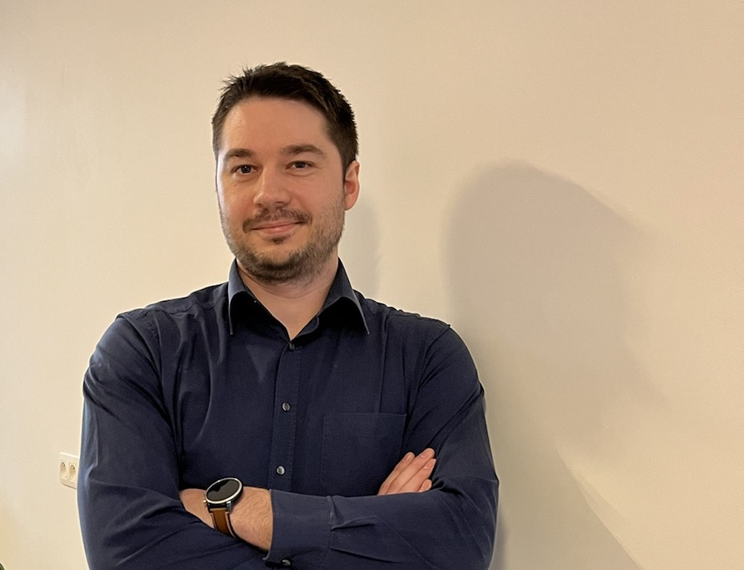

## Ja, nog eentje 🎉

Nog een blog!

Wanneer je een blog leest verwacht je slechts informatie, iets wat licht leest, een andere kijk, ...

Maar net zoals ik krijg je van overal reclame, wordt beladen met allemaal verschillende links.
Deze informatie is eigenlijk meer clickbait (cliché want ik ga dat ook doen :smirk:)

## Wie ben ik?

Mijn naam is Tim Van Den Bosch,

Ik ben gebeten door IT van kinds af aan. Ik volg dan ook de spelers op de markt net zoals de kleinste innovaties. Het fijne hieraan is om deze informatie dan ook te delen.
Als partner op de werkvloer als ook privé probeer ik dan ook iedereen mee te krijgen met onze technologische vooruitgangen.
Hoe meer kennis ik kan overbrengen hoe beter!

### Ik weet waar ik over praat omdat?

Van opleiding heb ik de basis van Electro-Mechanica, hierbij leer je eigenlijk door het te doen. Uit elkaar halen en terug in elkaar steken. Dit heeft mij dan ook het probleem oplossend denken aangebracht.

Als werknemer ben ik eerst met mijn handen begonnen, je beseft pas wat hard werken is als je het effectief gedaan hebt.
Als bijrijder bij Vandenborre, bouwvakker op ruwbouwwerven, electrisch instalateur van koelingsinstallaties en onderhoudsmechanicus weet ik dat ik op de dag van vandaag _"men beide pollekes mag kussen"!_
Deze beroepen hebben mij het perspectief gegeven dat een probleem er een is die je er zelf van maakt.

Hierdoor weet ik dat een job niet "werk" hoeft te zijn. Het kan ook je passie zijn. Een voor de hand liggende keuze voor mij want ik ademde practisch 1'tjes en 0'en. Computers in elkaar steken, programma's installeren, een aantal kleine websites en een aantal scripts om mensen sneller te kunnen helpen met problemen.

### Hoe ga ik om met projecten?

Voor mij zal IT altijd wel een centrale positie hebben op het digitaal aspect van een onderneming. Ik ben er dan ook van overtuigd dat als er geen afgestelde opstelling is voor een zaak er geregeld problemen kunnen optreden.

Mijn insteek zal dan ook altijd zijn om te kijken naar de nieuwste mogelijke oplossing waar de onderneming nog een lange tijd mee verder kan. Op die manier zijn niet alleen mijn klanten maar ook ik gerust.

Ik vind het dan ook belangrijk dat de mensen waar ik mee samenwerk zich in een ondersteunende rol kunnen positioneren, hierdoor wordt iedereen beter in hetgeen zij doen én leren we bij! Mocht het echter zijn dat er kennis te kort is, beschik ik over een netwerk van freelancers waarbij we advies of zelfs een betere match kunnen vinden!

## Wie ben jij?

Nu even genoeg over mij. Heb je vragen of wil een kennismakingsgesprek dan kan je deze zeker [aanvragen](https://calendly.com/itvb/30min)!
Intressante onderwerpen neem ik mee in de blog, dus zeker sturen!

Tot snel

Tim
